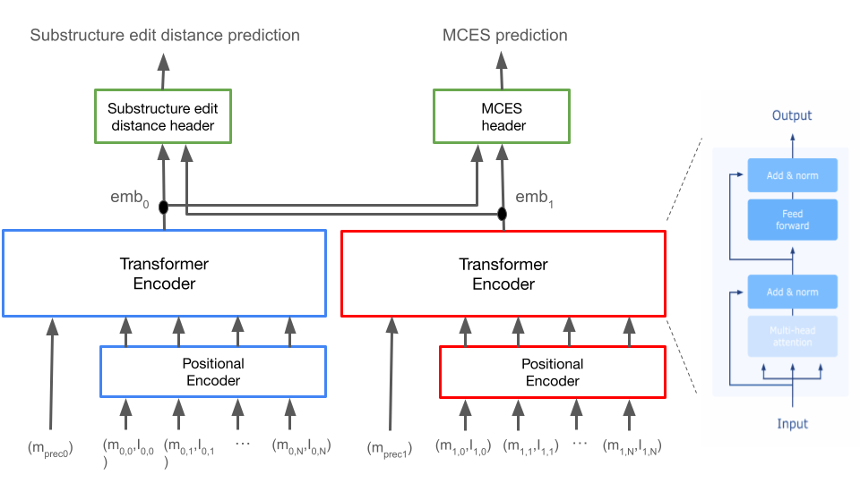

<p align="center">
  
</p>

# SIMBA: Spectral Identification of Molecule Bio-Analogues

[](https://simba-ms.readthedocs.io/en/latest/)
[](https://www.python.org/downloads/)

**SIMBA** is a transformer-based neural network that accurately predicts chemical structural similarity from tandem mass spectrometry (MS/MS) spectra. Unlike traditional methods relying on heuristic metrics (e.g., modified cosine similarity), SIMBA directly models structural differences, enabling precise analog identification in metabolomics.

SIMBA predicts two interpretable metrics:

1. **Substructure Edit Distance**: Number of molecular graph edits required to convert one molecule into another.
2. **Maximum Common Edge Substructure (MCES) Distance**: Number of bond modifications required to achieve molecular equivalence.

---

## 🚀 Quickstart

### Requirements
- Python 3.11.x (tested with 3.11.7)
- [UV](https://docs.astral.sh/uv/) (recommended) or [Conda](https://docs.conda.io/en/latest/)

### Installation

#### Option 1: UV (Recommended - Fastest ⚡)

**Install UV:**
```bash
# macOS/Linux
curl -LsSf https://astral.sh/uv/install.sh | sh

# Windows
powershell -c "irm https://astral.sh/uv/install.ps1 | iex"
```

**Setup SIMBA (~2-5 minutes):**
```bash
# Clone the repository
git clone https://github.com/bittremieux-lab/simba.git
cd simba

# Create virtual environment and install dependencies
uv sync

# Activate the environment
source .venv/bin/activate  # macOS/Linux
# or
.venv\Scripts\activate     # Windows
```

**For Jupyter notebooks:**
```bash
# Install notebook dependencies
uv sync --extra notebooks

# Register the kernel
python -m ipykernel install --user --name=simba --display-name="SIMBA (UV)"
```

**To use notebooks in VS Code:**
1. Open any `.ipynb` file in the `notebooks/` folder
2. Click "Select Kernel" in the top-right corner
3. Choose "SIMBA (UV)" or "Python 3.11 (.venv: venv)"
4. If the kernel doesn't appear, reload VS Code window (Cmd+Shift+P → "Developer: Reload Window")

#### Option 2: Conda (Alternative)

```bash
# Create and activate environment
conda env create -f environment.yml
conda activate simba

# Install the module
pip install -e .
```

**Note for macOS users:**
```bash
brew install xz
```

---

## 🔎 Computing Structural Similarities

We provide a pretrained SIMBA model trained on spectra from  **MassSpecGym**. The model operates in positive ionization mode for protonated adducts.

### Usage Example

Follow the [Run Inference Notebook](https://github.com/bittremieux-lab/simba/tree/main/notebooks/final_tutorials/run_inference.ipynb) for a comprehensive tutorial:

- **Runtime:** < 10 minutes (including model/data download)
- **Example data:** data folder.
- **Supported format:** `.mgf`

### Performance

Using an Apple M3 Pro (36 GB RAM):
- **Embedding computation:** ~100,000 spectra in ~1 minute
- **Similarity computation:** 1 query vs. 100,000 spectra in ~10 seconds

SIMBA caches computed embeddings, significantly speeding repeated library searches.

<p align="center">
  
</p>

---

## 🔬 Analog Discovery Using SIMBA

Modern metabolomics relies on tandem mass spectrometry (MS/MS) to identify unknown compounds by comparing their spectra against large reference libraries. SIMBA enables analog discovery—finding structurally related molecules—by predicting the 2 complementary, interpretable metrics directly from spectra.

### Usage Example

Perform analog discovery to find structurally similar molecules:

```bash
simba analog-discovery \
  --model-path /path/to/model.ckpt \
  --query-spectra /path/to/query.mgf \
  --reference-spectra /path/to/reference_library.mgf \
  --output-dir /path/to/output \
  analog_discovery.query_index=0 \
  analog_discovery.top_k=10
```

**Common Parameters:**
* `--model-path`: Path to trained SIMBA model checkpoint (.ckpt file) - **REQUIRED**
* `--query-spectra`: Path to query spectra file (.mgf or .pkl format) - **REQUIRED**
* `--reference-spectra`: Path to reference library spectra file (.mgf or .pkl format) - **REQUIRED**
* `--output-dir`: Directory where results will be saved - **REQUIRED**
* `analog_discovery.query_index`: Index of specific query to analyze (default: null = all queries)
* `analog_discovery.top_k`: Number of top matches to return (default: 10)
* `analog_discovery.device`: Hardware device: `cpu` or `gpu` (default: cpu)
* `analog_discovery.batch_size`: Batch size for processing (default: 32)
* `analog_discovery.compute_ground_truth`: Compute ground truth for validation (default: false)
* `analog_discovery.save_rankings`: Save complete ranking matrix (default: true)

**Quick Testing (Fast Dev Mode):**

```bash
# Use fast_dev preset for quick testing (batch size 8, top-K 5, individual plots)
simba analog-discovery analog_discovery=fast_dev \
  --model-path ./models/best_model.ckpt \
  --query-spectra ./data/casmi2022.mgf \
  --reference-spectra ./data/casmi2022.mgf \
  --output-dir ./results_test/ \
  analog_discovery.query_index=0
```

**Production Examples:**

```bash
# Find analogs for specific query
simba analog-discovery \
  --model-path ./models/best_model.ckpt \
  --query-spectra ./data/casmi2022.mgf \
  --reference-spectra ./data/massspecgym.mgf \
  --output-dir ./results/query_5/ \
  analog_discovery.query_index=5 \
  analog_discovery.top_k=20 \
  analog_discovery.compute_ground_truth=true

# Process all queries with GPU
simba analog-discovery \
  --model-path ./models/best_model.ckpt \
  --query-spectra ./data/queries.mgf \
  --reference-spectra ./data/library.mgf \
  --output-dir ./results/all_queries/ \
  analog_discovery.device=gpu \
  analog_discovery.batch_size=64 \
  analog_discovery.save_individual_plots=false
```

**Output Files:**
- `analog_discovery_results.json`: Summary of top matches with predictions
- `distributions.png`: Distribution plots for ED, MCES, and ranking scores
- `query_N/`: Directory with visualizations for each query (if enabled)
  - `query_molecule.png`: Structure of the query molecule
  - `query_spectrum.png`: Query spectrum visualization
  - `match_N_molecule.png`: Structures of matched molecules
  - `match_N_mirror.png`: Mirror plots comparing spectra

**Jupyter Notebook (Interactive):**

For interactive exploration, use the [Run Analog Discovery Notebook](https://github.com/bittremieux-lab/simba/tree/main/notebooks/final_tutorials/run_analog_discovery.ipynb).

The notebook demonstrates:
* Loading a pretrained SIMBA model and MS/MS data
* Computing distance matrices between query and reference spectra
* Extracting top analogs for a given query
* Comparing predictions against ground truth and visualizing matches

---

**Note:** Both methods produce equivalent results. The CLI command is recommended for automated workflows and batch processing, while the notebook is better for interactive analysis and visualization.

---

## 📚 Training Your Custom SIMBA Model

SIMBA supports training custom models using your own MS/MS datasets in `.mgf` format.

### Step 1: Generate Training Data

Preprocess your MS/MS spectral data:

```bash
simba preprocess \
  paths.spectra_path=/path/to/your/spectra.mgf \
  paths.preprocessing_dir=/path/to/preprocessed_data \
  preprocessing.max_spectra_train=10000
```

**Common Parameters:**
* `paths.spectra_path`: Path to input spectra file (.mgf format) - **REQUIRED**
* `paths.preprocessing_dir`: Directory where preprocessed data will be saved - **REQUIRED**
* `preprocessing.max_spectra_train`: Maximum number of spectra to process for training (default: 1000)
* `preprocessing.max_spectra_val`: Maximum number of spectra for validation (default: 1000)
* `preprocessing.max_spectra_test`: Maximum number of spectra for testing (default: 1000)
* `preprocessing.val_split`: Fraction of data for validation (default: 0.1)
* `preprocessing.test_split`: Fraction of data for testing (default: 0.1)
* `preprocessing.overwrite`: Overwrite existing preprocessing files (default: false)
* `preprocessing.num_workers`: Number of worker processes for parallel computation (default: 0)

**Multi-Node Preprocessing:**

For large datasets, SIMBA supports distributed preprocessing across multiple compute nodes or servers.

**Key Parameters:**
* `preprocessing.num_nodes`: Total number of nodes participating in preprocessing (default: 1)
* `preprocessing.current_node`: Zero-indexed ID of this node (0, 1, 2, ..., num_nodes-1)
* `preprocessing.num_workers`: Number of CPU workers for this node

**Special scenario: Heterogeneous Multi-Node**

Three servers with different CPU counts (64, 32, and 48 cores):

```bash
# 64 cores node
simba preprocess \
  paths.spectra_path=data/spectra.mgf \
  paths.preprocessing_dir=/shared/output \
  preprocessing.max_spectra_train=1000000 \
  preprocessing.num_nodes=3 \
  preprocessing.current_node=0 \
  preprocessing.num_workers=64

# 32 cores node
simba preprocess \
  paths.spectra_path=data/spectra.mgf \
  paths.preprocessing_dir=/shared/output \
  preprocessing.max_spectra_train=1000000 \
  preprocessing.num_nodes=3 \
  preprocessing.current_node=1 \
  preprocessing.num_workers=32

# 48 cores node
simba preprocess \
  paths.spectra_path=data/spectra.mgf \
  paths.preprocessing_dir=/shared/output \
  preprocessing.max_spectra_train=1000000 \
  preprocessing.num_nodes=3 \
  preprocessing.current_node=2 \
  preprocessing.num_workers=48
```

**Important Notes:**
- All nodes should use the **same input spectra file** and configuration parameters
- Results are saved with unique node identifiers (e.g., `train_node0_chunk0.npy`)
- Files are automatically combined during training or inference

---

**Reusing Precomputed Distances:**

To speed up preprocessing when working with related datasets (e.g., MS2-only, MS3-only, and joint MS2+MS3), you can reuse previously computed molecular distances:

```bash
# First: preprocess MS2-only data
simba preprocess \
  paths.spectra_path=ms2_spectra.mgf \
  paths.preprocessing_dir=./ms2_preprocessing/

# Then: preprocess MS3-only data
simba preprocess \
  paths.spectra_path=ms3_spectra.mgf \
  paths.preprocessing_dir=./ms3_preprocessing/

# Finally: preprocess joint dataset, reusing distances from both
simba preprocess \
  paths.spectra_path=joint_spectra.mgf \
  paths.preprocessing_dir=./joint_preprocessing/ \
  'preprocessing.precomputed_distances=[./ms2_preprocessing/, ./ms3_preprocessing/]'
```

The cache automatically:
- Finds all distance files (`edit_distance_*.npy`, `mces_*.npy`) in each directory
- Loads SMILES mappings from `mapping_unique_smiles.pkl`
- Matches molecules by SMILES strings (robust to different splits/filters)
- Logs cache hit/miss statistics during computation

**Cache hit rate = % of molecule pairs that were reused instead of recomputed!**

---

**Quick Testing (Fast Dev Mode):**

```bash
# Use fast_dev preset for quick testing (20 spectra per split)
simba preprocess preprocessing=fast_dev \
  paths.spectra_path=data/casmi2022.mgf \
  paths.preprocessing_dir=./preprocessed_casmi2022_test/
```

**Production Examples:**

```bash
# Process all spectra with multiple workers
simba preprocess \
  paths.spectra_path=data/spectra.mgf \
  paths.preprocessing_dir=./preprocessed_data \
  preprocessing.max_spectra_train=1000000 \
  preprocessing.num_workers=4

# Custom splits and overwrite existing data
simba preprocess \
  paths.spectra_path=data/spectra.mgf \
  paths.preprocessing_dir=./preprocessed_data \
  preprocessing.val_split=0.15 \
  preprocessing.test_split=0.15 \
  preprocessing.overwrite=true
```

---

**What preprocessing computes:**
- Edit distance between molecular structures
- MCES (Maximum Common Edge Substructure) distance
- Train/validation/test splits
- A pickle file `mapping_unique_smiles.pkl` with mapping information between unique compounds and corresponding spectra

### Output
- Numpy arrays with indexes and structural similarity metrics
- Pickle file (`mapping_unique_smiles.pkl`) mapping spectra indexes to SMILES structures

### Accessing Data Mapping
```python
import pickle

with open('/path/to/output_dir/mapping_unique_smiles.pkl', 'rb') as f:
    data = pickle.load(f)

mol_train = data['molecule_pairs_train']
print(mol_train.df_smiles)
```
The dataframe df_smiles contains the mapping from indexes of unique compounds to the original spectra loaded.

### Step 2: Model Training

Train your SIMBA model:

```bash
simba train \
  paths.preprocessing_dir_train=/path/to/preprocessed_data \
  paths.checkpoint_dir=/path/to/checkpoints \
  training.epochs=100 \
  hardware.accelerator=cpu
```

**Common Parameters:**
* `paths.preprocessing_dir_train`: Directory with preprocessing files - **REQUIRED** (or use `paths.preprocessing_dir`)
* `paths.checkpoint_dir`: Directory where trained model will be saved - **REQUIRED**
* `training.epochs`: Number of training epochs (default: 1000)
* `training.batch_size`: Batch size for training (default: 128)
* `optimizer.lr`: Learning rate (default: 0.0001)
* `hardware.accelerator`: Hardware device: `cpu`, `gpu`, or `mps` (default: gpu)
* `hardware.num_workers`: Number of data loading workers (default: 0)
* `training.val_check_interval`: Validation frequency in steps (default: 10000)

**Quick Testing (Fast Dev Mode):**

```bash
# Use fast_dev preset for quick testing (20 epochs, batch size 8, CPU, 20 spectra)
simba train training=fast_dev \
  paths.preprocessing_dir_train=./preprocessed_casmi2022_test/ \
  paths.checkpoint_dir=./checkpoints_test/
```

**Production Examples:**

```bash
# Full training with GPU
simba train \
  paths.preprocessing_dir_train=./preprocessed_data \
  paths.checkpoint_dir=./checkpoints \
  training.epochs=1000 \
  training.batch_size=128 \
  optimizer.lr=0.0001 \
  hardware.accelerator=gpu

# Custom training configuration
simba train \
  paths.preprocessing_dir_train=./preprocessed_data \
  paths.checkpoint_dir=./checkpoints \
  training.epochs=50 \
  training.batch_size=64 \
  hardware.accelerator=gpu
```

---

**Note:** The best-performing model (lowest validation loss) is automatically saved as `best_model.ckpt` in your checkpoint directory.

---

### Step 3: Model Inference & Evaluation

Run inference on test data using your trained model:

```bash
simba inference \
  paths.checkpoint_dir=/path/to/checkpoints/ \
  paths.preprocessing_dir=/path/to/preprocessed_data/
```

**Common Parameters:**
* `paths.checkpoint_dir`: Directory containing the trained model checkpoint - **REQUIRED**
* `paths.preprocessing_dir`: Directory where preprocessed data is stored - **REQUIRED**
* `paths.output_dir`: Directory to save plots and results (optional, defaults to checkpoint-dir)
* `inference.preprocessing_pickle`: Filename of the dataset pickle file (default: `preprocessed_data.pkl`)
* `inference.batch_size`: Batch size for inference (default: 64)
* `hardware.accelerator`: Hardware accelerator: `cpu`, `gpu`, or `auto` (default: auto)
* `inference.use_last_model`: Use last.ckpt instead of best_model.ckpt (default: false)
* `inference.uniformize_during_testing`: Balance edit distance classes during testing (default: true)

**Quick Testing (Fast Dev Mode):**

```bash
# Use fast_dev preset for quick testing on CPU (batch size 8, no uniformization)
simba inference inference=fast_dev \
  paths.checkpoint_dir=./checkpoints_test/ \
  paths.preprocessing_dir=./preprocessed_casmi2022_test/ \
  inference.preprocessing_pickle=mapping_unique_smiles.pkl
```

The `fast_dev` configuration automatically:
- Uses CPU accelerator (avoids GPU/MPS issues during development)
- Sets batch_size to 8 for faster iteration
- Disables uniformization for quicker results
- Enables progress bar for better visibility

**Production Examples:**

```bash
# Standard inference with best model
simba inference \
  paths.checkpoint_dir=./checkpoints \
  paths.preprocessing_dir=./preprocessed_data

# Use last checkpoint with custom settings
simba inference \
  paths.checkpoint_dir=./checkpoints \
  paths.preprocessing_dir=./preprocessed_data \
  inference.use_last_model=true \
  inference.batch_size=32

# Disable uniformization for faster inference
simba inference \
  paths.checkpoint_dir=./checkpoints \
  paths.preprocessing_dir=./preprocessed_data \
  inference.uniformize_during_testing=false

# Custom output directory
simba inference \
  paths.checkpoint_dir=./checkpoints \
  paths.preprocessing_dir=./preprocessed_data \
  paths.output_dir=./inference_results
```

**Output:**
The command generates evaluation metrics and visualization plots:
- ✓ Edit distance correlation (Spearman)
- ✓ MCES/Tanimoto correlation (Spearman)
- Confusion matrix for edit distance predictions (`cm.png`)
- Hexbin plot showing prediction accuracy (`hexbin_plot_*.png`)
- Scatter plot of predictions vs. ground truth (`scatter_plot_*.png`)

---

## Hyperparameter Search

SIMBA includes a built-in Optuna-based hyperparameter sweep via the `simba-sweep` command. All trials run **sequentially in a single job**. Results are written to `trials.json` after every trial, enabling **resume** with full knowledge after a crash or walltime limit.

### Configuring the Search Space

Edit `simba/configs/sweep/default.yaml` to define which hyperparameters to search. Each entry under `sweep.params` requires a `type` and bounds/choices:

```yaml
sweep:
  n_trials: 10
  output_dir: ./sweeps/run1
  resume: false
  params:
    optimizer.lr:
      type: loguniform
      low: 1.0e-5
      high: 1.0e-2

    model.transformer.d_model:
      type: categorical
      choices: [128, 256, 512]

    model.transformer.n_layers:
      type: int
      low: 3
      high: 8

    training.gradient_clip_val:
      type: uniform
      low: 0.5
      high: 2.0
```

Supported `type` values: `loguniform`, `uniform`, `int`, `categorical`.

Any valid Hydra config key (e.g. `optimizer.lr`, `model.transformer.d_model`, `training.batch_size`) can be added without touching Python code.

### Running a Sweep Locally

```bash
simba-sweep \
    +sweep=default \
    sweep.n_trials=10 \
    sweep.output_dir=./sweeps/run1 \
    paths.preprocessing_dir_train=./preprocessed_data \
    training.epochs=10 \
    hardware.accelerator=cpu
```

### Resuming After Interruption

Set `sweep.resume=true` to continue from where the sweep left off. TPE will use all previously completed trials to guide new ones:

### Starting from Known Good Parameters

You can seed the sweep with specific hyperparameter combinations that run as the first trial(s) before TPE takes over — useful when you have prior knowledge of a reasonable starting point:

```yaml
# In simba/configs/sweep/default.yaml — uncomment and edit:
sweep:
  starting_params:
    - optimizer.lr: 0.001
      model.transformer.d_model: 256
      model.transformer.n_layers: 5
      training.gradient_clip_val: 1.0
    - optimizer.lr: 0.0001
      model.transformer.d_model: 512
      model.transformer.n_layers: 3
      training.gradient_clip_val: 0.5
```

- All keys must be valid params listed under `sweep.params`
- Multiple starting points are supported — each runs as a separate trial
- Ignored when `sweep.resume=true` (TPE already has prior knowledge)

### Output Structure

```text
sweeps/run1/
├── trials.json                  # All trial results (params + val_loss)
├── checkpoints/
│   ├── 0/
│   │   ├── best_model.ckpt      # Best checkpoint for trial 0
│   │   └── params.json          # Hyperparams used for this checkpoint
│   ├── 1/
│   │   └── ...
│   └── ...
└── best_inference/
    ├── metrics.json             # ED & MCES correlation + MAE for best trial
    ├── cm.png                   # Confusion matrix
    ├── hexbin_plot_*.png
    └── scatter_plot_*.png
```

After all trials, inference is automatically run on the best trial's checkpoint and metrics/plots are saved to `best_inference/`.

## Development & Contributing

### Setting Up Development Environment

```bash
# Clone and install with dev dependencies
git clone https://github.com/bittremieux-lab/simba.git
cd simba
uv sync --all-extras

# Install pre-commit hooks
uv run pre-commit install
```

### Running Tests

```bash
# Run all tests
uv run pytest tests/ -v

# Run with coverage report
uv run pytest tests/ --cov=simba --cov-report=html --cov-report=term-missing

# View coverage report
open htmlcov/index.html
```

### Code Quality

The project uses:
- **Ruff** for linting and formatting
- **pytest** for testing
- **pre-commit hooks** for automated checks

```bash
# Run linter
uv run ruff check simba/

# Format code
uv run ruff format simba/

# Run pre-commit on all files
uv run pre-commit run --all-files
```

Pre-commit hooks automatically run on every commit and check:
- Code formatting (Ruff)
- Linting (Ruff)
- Tests (pytest)
- File formatting (trailing whitespace, line endings)
- YAML/TOML syntax

### Documentation

Full documentation is available at **<https://simba-ms.readthedocs.io/>**

**To build documentation locally:**

```bash
# Navigate to docs directory
cd docs

# Build HTML documentation
make html                # macOS/Linux
# or
make.bat html           # Windows

# View the generated documentation
open build/html/index.html       # macOS
# or
xdg-open build/html/index.html   # Linux
# or
start build/html/index.html      # Windows
```

Built documentation will be available at `docs/build/html/index.html`.

---

## 📬 Contact & Support

- **Code repository**: [SIMBA GitHub](https://github.com/bittremieux-lab/simba)
- For questions, issues, or feature requests, please [open an issue](https://github.com/bittremieux-lab/simba/issues).

---

## 📦 Data Availability

- Training and testing datasets available at: [https://zenodo.org/records/15275257].

---

## 📄 License

SIMBA is distributed under the Apache License, Version 2.0. See the [LICENSE](LICENSE) file for more details.

---
